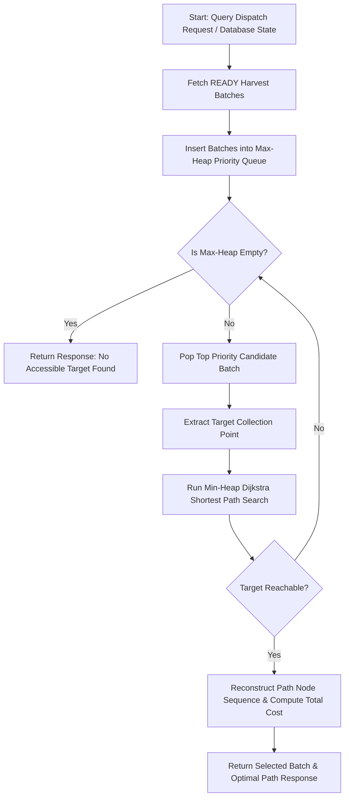

# AgriPulse - Smart Tea Plantation & Agricultural Supply Chain IDSS
## Backend Service: Module 1 - Urgent Tea Collection Dispatch & Route Engine

---

## 1. Executive Overview & Problem Context

### System Context
**AgriPulse Intelligent Decision Support System (IDSS)** is an enterprise agricultural supply chain platform engineered for high-altitude tea plantations in tropical monsoon regions. Freshly plucked tea leaves undergo rapid degradation due to oxidation and thermal buildup in collection bags. If processing is delayed beyond critical freshness windows, the leaf quality score drops significantly, causing direct financial loss to tea estates and factories.

### Operational Problem Statement
Collection trucks operate across rugged, steep mountain terrain with dynamic road network challenges:
- **Leaf Spoilage & Priority Urgency:** Harvest batches must be collected in order of urgency (`priorityScore`), which factors in harvest timestamp, batch weight, and ambient ambient conditions.
- **Dynamic Terrain & Weather Penalties:** Roads vary in surface condition (paved vs. degraded gravel), incline gradient, and seasonal monsoon impacts (flash floods, mudslides).
- **Road Closures & Blockages:** Landslides or fallen trees can close road segments (`isOpen == false`), making them completely impassable.

### Module 1 Objective
Module 1 serves as the **Urgent Tea Collection Dispatch & Route Engine**. Given a truck's current location node in the plantation road network, ready harvest batches across collection points, and real-time road conditions, Module 1:
1. Identifies the **highest-priority eligible harvest batch** using a **Max-Heap Priority Queue**.
2. Computes the **lowest-cost accessible route** to that target using **Min-Heap Dijkstra's Algorithm**.
3. Dynamically handles **fallback routing**: if the highest-priority target is physically unreachable due to road blockages, the system automatically falls back to the next highest priority ready batch until an accessible route is calculated.

---

## 2. Algorithmic Design & Mathematical Model

The routing engine combines two classical data structures to optimize logistics under dynamic constraints:



### A. Target Selection (Max-Heap Priority Queue)
Ready harvest batches are maintained in a Max-Heap ordered by `priorityScore`:
- **Insertion & Extraction:** $O(\log N)$ extraction time for $N$ candidate batches.
- **Priority Order:** Higher priority scores extract first. If priority scores match, deterministic tie-breaking by `batchId` is enforced.
- **Fallback Loop:** If Dijkstra reports that candidate $B_1$ is unreachable ($\text{cost} = \infty$), $B_1$ is discarded and the next candidate $B_2$ is popped from the Max-Heap.

### B. Shortest Path Computation (Min-Heap Dijkstra)
Given starting truck node $u_{start}$ and target collection point $v_{target}$:
- **Graph Structure:** Adjacency List `Map<String, List<RoadEdge>>`.
- **Min-Heap Traversal:** Nodes are explored using a Min-Heap priority queue ordered by accumulated distance $d[v]$.
- **Predecessor Tracking:** A map `parent[v] = u` tracks the optimal inward edge for sequence reconstruction from $v_{target}$ back to $u_{start}$.

### C. Edge Weight & Effective Cost Formula
For each directed road edge from node $u$ to node $v$:

$$\text{Effective Cost} = \text{distance} \times \text{inclineFactor} \times \text{qualityPenalty} \times (\text{monsoonAffected} \ ? \ 1.5 : 1.0)$$

#### Parameter Definitions:
- $\text{distance}$: Physical road length in kilometers.
- $\text{inclineFactor}$: Gradient multiplier ($\ge 1.0$) accounting for engine strain and slower uphill travel.
- $\text{qualityPenalty}$: Surface degradation multiplier ($\ge 1.0$; e.g. 1.0 for paved asphalt, 1.3 for rough gravel).
- $\text{monsoonAffected}$: Boolean flag triggering a **$1.5\times$ penalty factor** for heavy rainfall, mud, or low visibility.
- **Road Closure Constraint:** If `isOpen == false`, the edge cost is assigned $\infty$ (`Double.POSITIVE_INFINITY`) and ignored during Dijkstra node relaxation.

---

## 3. Architecture & Tech Stack

### Core Technologies
- **Java:** 17 (JDK 17)
- **Framework:** Spring Boot 3.2.5 (`spring-boot-starter-web`, `spring-boot-starter-validation`, `spring-boot-starter-data-jpa`)
- **Database:** PostgreSQL 15 (with Docker Compose support)
- **ORM / Persistence:** Spring Data JPA / Hibernate
- **Testing:** JUnit 5 & Mockito (`spring-boot-starter-test`)
- **Build Tool:** Apache Maven

### Package & Directory Structure

```text
AgriPulse_Backend/
├── database/
│   └── init.sql                              # PostgreSQL schema initialization & seed script
├── postman/
│   └── sample_dispatch_request.json          # Postman sample request payload
├── src/
│   ├── main/
│   │   ├── java/
│   │   │   └── com/
│   │   │       └── agripulse/
│   │   │           ├── AgriPulseApplication.java            # Main Spring Boot Entry Point
│   │   │           ├── controller/
│   │   │           │   └── DispatchController.java          # REST API Endpoints
│   │   │           ├── dto/
│   │   │           │   ├── DispatchRequestDto.java          # Request body DTO
│   │   │           │   ├── DispatchResponseDto.java         # Response body DTO
│   │   │           │   └── RoadStatusUpdateDto.java         # Road condition update DTO
│   │   │           ├── model/
│   │   │           │   ├── HarvestBatch.java                # Max-Heap Comparable Batch Model
│   │   │           │   ├── RoadEdge.java                    # Graph Edge & Cost Calculator
│   │   │           │   └── entity/
│   │   │           │       ├── CollectionPoint.java         # JPA Entity (collection_points)
│   │   │           │       ├── HarvestBatchEntity.java      # JPA Entity (harvest_batches)
│   │   │           │       └── Road.java                    # JPA Entity (roads)
│   │   │           ├── repository/
│   │   │           │   ├── CollectionPointRepository.java   # Spring Data JPA Repository
│   │   │           │   ├── HarvestBatchRepository.java      # Spring Data JPA Repository
│   │   │           │   └── RoadRepository.java              # Spring Data JPA Repository
│   │   │           └── service/
│   │   │               └── routing/
│   │   │                   ├── DijkstraService.java         # Min-Heap Dijkstra Implementation
│   │   │                   └── DispatchService.java         # Dynamic Dispatch & Max-Heap Orchestrator
│   │   └── resources/
│   │       └── application.properties             # Spring configuration & DB datasource settings
│   └── test/
│       └── java/
│           └── com/
│               └── agripulse/
│                   └── routing/
│                       └── DispatchServiceTest.java         # JUnit 5 Unit Test Suite
├── docker-compose.yml                        # PostgreSQL container definition
├── pom.xml                                   # Maven dependencies & build configuration
└── README.md                                 # Technical documentation
```

---

## 4. Step-by-Step Setup & Run Guide

### Prerequisites
- **Java Development Kit (JDK):** Version 17 or higher (`java -version`).
- **Build Tool:** Apache Maven (`mvn -version`) or Maven Wrapper.
- **Container Environment (Recommended):** Docker Desktop (`docker --version`).

---

### Step 1: Database Initialization with Docker

Start the PostgreSQL container:

```bash
docker compose up -d
```

Verify that the container `agripulse_postgres` is running on port `5432`:

```bash
docker ps
```

*Note: If using local PostgreSQL without Docker, create database `agripulse_db` with user `postgres` and password `postgres`.*

---

### Step 2: Application Configuration

Check `src/main/resources/application.properties` connection defaults:

```properties
spring.application.name=AgriPulse_Backend
server.port=8080

# PostgreSQL Configuration
spring.datasource.url=${SPRING_DATASOURCE_URL:jdbc:postgresql://localhost:5432/agripulse_db}
spring.datasource.username=${SPRING_DATASOURCE_USERNAME:postgres}
spring.datasource.password=${SPRING_DATASOURCE_PASSWORD:postgres}
spring.datasource.driver-class-name=org.postgresql.Driver

# JPA / Hibernate Settings
spring.jpa.hibernate.ddl-auto=update
spring.jpa.show-sql=false
spring.jpa.properties.hibernate.format_sql=true
spring.jpa.properties.hibernate.dialect=org.hibernate.dialect.PostgreSQLDialect
```

---

### Step 3: Application Build & Execution

#### Option A: Windows PowerShell
```powershell
$env:JAVA_HOME="C:\Path\To\Your\jdk-17"
mvn clean spring-boot:run
```

#### Option B: Linux / macOS Terminal
```bash
export JAVA_HOME=/path/to/jdk-17
mvn clean spring-boot:run
```

Once started, the backend service listens on:
```text
http://localhost:8080/api/v1/dispatch
```

---

## 5. API Reference & Endpoint Specifications

### 1. Seed Initial Database Data
Populates default collection points (`C1`–`C6`), roads, and ready harvest batches (`B-102`, `B-091`) into PostgreSQL.

- **HTTP Method:** `POST`
- **URL Path:** `/api/v1/dispatch/seed-data`
- **Request Headers:** `Content-Type: application/json`
- **Response `200 OK`:**
```json
"Initial seed data successfully populated (Nodes C1-C6, 7 Roads, Batches B-102 and B-091)."
```

---

### 2. Get Next Route from Database State
Queries live database roads and `READY` harvest batches, evaluates candidate priorities using Max-Heap, and computes the optimal Dijkstra route from the specified truck node.

- **HTTP Method:** `GET`
- **URL Path:** `/api/v1/dispatch/next-route?truckNode=C1`
- **Query Parameters:** `truckNode` (String, default = `"C1"`)
- **Response `200 OK`:**
```json
{
  "selectedBatchId": "B-102",
  "targetCollectionPoint": "C6",
  "priorityScore": 95.0,
  "recommendedPath": [
    "C1",
    "C2",
    "C3",
    "C4",
    "C6"
  ],
  "totalRouteCost": 48.06,
  "statusMessage": "Optimal route successfully computed to highest priority accessible target"
}
```

---

### 3. Calculate Route (In-Memory Payload)
Stateless calculation endpoint accepting arbitrary graph structures and batch priorities directly in the request JSON payload.

- **HTTP Method:** `POST`
- **URL Path:** `/api/v1/dispatch/calculate-route`
- **Request Body:**
```json
{
  "truckCurrentNode": "C1",
  "readyBatches": [
    {
      "batchId": "B-101",
      "collectionPointId": "C6",
      "priorityScore": 98.5,
      "ready": true
    },
    {
      "batchId": "B-102",
      "collectionPointId": "C4",
      "priorityScore": 87.0,
      "ready": true
    }
  ],
  "roadGraph": {
    "C1": [
      {
        "toNode": "C6",
        "distance": 12.0,
        "inclineFactor": 1.0,
        "qualityPenalty": 1.0,
        "monsoonAffected": false,
        "open": false
      },
      {
        "toNode": "C4",
        "distance": 8.0,
        "inclineFactor": 1.1,
        "qualityPenalty": 1.0,
        "monsoonAffected": true,
        "open": true
      }
    ],
    "C4": []
  }
}
```
- **Response `200 OK`:**
```json
{
  "selectedBatchId": "B-102",
  "targetCollectionPoint": "C4",
  "priorityScore": 87.0,
  "recommendedPath": [
    "C1",
    "C4"
  ],
  "totalRouteCost": 13.2,
  "statusMessage": "Optimal route successfully computed to highest priority accessible target"
}
```

---

### 4. Dynamic Road Condition Update
Updates road segment status (`isOpen` and `monsoonStatus`) in PostgreSQL.

- **HTTP Method:** `PUT`
- **URL Path:** `/api/v1/dispatch/roads/{id}/status`
- **Path Variable:** `id` (Long, road record ID)
- **Request Body:**
```json
{
  "isOpen": false,
  "monsoonStatus": true
}
```
- **Response `200 OK`:**
```json
{
  "id": 1,
  "fromPointId": "C1",
  "toPointId": "C2",
  "distance": 5.0,
  "incline": 1.0,
  "roadQuality": 1.0,
  "monsoonStatus": true,
  "isOpen": false,
  "capacityKgPerDay": 2000.0
}
```

---

### 5. Mark Batch as Collected
Updates harvest batch status to `"COLLECTED"` in PostgreSQL and automatically triggers route recalculation for remaining ready batches.

- **HTTP Method:** `PUT`
- **URL Path:** `/api/v1/dispatch/batches/{id}/collect?truckNode=C1`
- **Path Variable:** `id` (String, batch ID e.g. `"B-102"`)
- **Query Parameter:** `truckNode` (String, default = `"C1"`)
- **Response `200 OK`:**
```json
{
  "selectedBatchId": "B-091",
  "targetCollectionPoint": "C4",
  "priorityScore": 75.0,
  "recommendedPath": [
    "C1",
    "C2",
    "C3",
    "C4"
  ],
  "totalRouteCost": 22.16,
  "statusMessage": "Batch B-102 marked as COLLECTED. Optimal route successfully computed to highest priority accessible target"
}
```

---

## 6. Step-by-Step Verification & Testing Guide

### Scenario A: Baseline Route Execution
1. Seed initial data:
   ```bash
   curl -X POST http://localhost:8080/api/v1/dispatch/seed-data
   ```
2. Request dispatch route for truck at `C1`:
   ```bash
   curl -X GET "http://localhost:8080/api/v1/dispatch/next-route?truckNode=C1"
   ```
3. **Expected Result:** Target batch `B-102` (priority score `95.0`) at `C6` is selected with path `["C1", "C2", "C3", "C4", "C6"]`.

---

### Scenario B: Dynamic Road Closure & Rerouting
1. Close the road connecting `C3` to `C4` (Road ID `3`):
   ```bash
   curl -X PUT http://localhost:8080/api/v1/dispatch/roads/3/status \
        -H "Content-Type: application/json" \
        -d '{"isOpen": false, "monsoonStatus": false}'
   ```
2. Request dispatch route again:
   ```bash
   curl -X GET "http://localhost:8080/api/v1/dispatch/next-route?truckNode=C1"
   ```
3. **Expected Result:** The engine bypasses closed road `C3->C4` and routes via alternative path `["C1", "C2", "C5", "C6"]` to collect `B-102`.

---

### Scenario C: Priority Progression after Batch Collection
1. Mark batch `B-102` as collected:
   ```bash
   curl -X PUT "http://localhost:8080/api/v1/dispatch/batches/B-102/collect?truckNode=C1"
   ```
2. **Expected Result:** Batch `B-102` transitions to `"COLLECTED"`. Max-Heap automatically advances to next ready batch `B-091` (priority `75.0`) at `C4`.

---

### Scenario D: Unreachable Target Fallback
1. Block all roads leading to a high-priority batch collection point (`C6`).
2. Request dispatch route:
   ```bash
   curl -X GET "http://localhost:8080/api/v1/dispatch/next-route?truckNode=C1"
   ```
3. **Expected Result:** Dijkstra detects `C6` is unreachable ($\text{cost} = \infty$). The Max-Heap pops `B-102`, discards it as unreachable, and safely falls back to `B-091` at `C4`.

---

## 7. Complexity & Performance Metrics

| Operation | Primary Algorithm | Time Complexity | Space Complexity |
|---|---|---|---|
| Priority Target Selection | Max-Heap Priority Queue | $O(K \log K)$ | $O(K)$ |
| Shortest Path Search | Min-Heap Dijkstra Algorithm | $O((V + E) \log V)$ | $O(V + E)$ |
| Path Reconstruction | Predecessor Backtracking | $O(P)$ | $O(P)$ |
| **Total Route Engine Pipeline** | **Max-Heap + Min-Heap Dijkstra** | **$O(K \cdot (V + E) \log V)$** | **$O(V + E + K)$** |

*Where:*
- $K$ = Number of ready harvest batches.
- $V$ = Number of collection point nodes in plantation road network.
- $E$ = Number of valid road edges.
- $P$ = Number of nodes along the recommended path ($P \le V$).

### Performance Benchmark
- **In-Memory Routing Overhead:** $< 2\text{ ms}$ for typical plantation network sizes ($V=100, E=300$).
- **Database Query Latency:** $< 10\text{ ms}$ with indexed primary keys and status fields in PostgreSQL.
